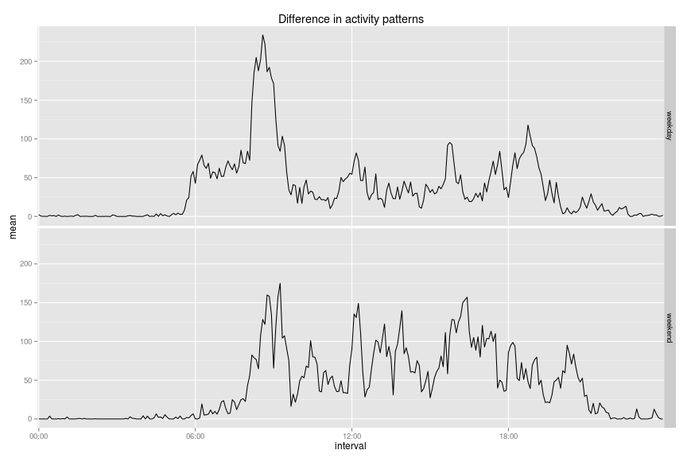

## Loading and preprocessing the data

```r
data.raw <- read.csv("../../data/raw/activity.csv")
data.raw$interval <- factor(data.raw$interval)
```

## What is mean total number of steps taken per day?

```r
# Total number of steps per day
steps.sum.by.day <- aggregate(data.raw$steps, by=list(data.raw$date), sum)
names(steps.sum.by.day) <- c("date", "steps")
mean.total.steps.by.day <- mean(steps.sum.by.day$steps, na.rm=TRUE)
median.total.steps.by.day <- median(steps.sum.by.day$steps, na.rm=TRUE)
```
The mean and the median total number of steps taken by day are 1.0766 &times; 10<sup>4</sup> and 1.0765 &times; 10<sup>4</sup>.


```r
# Histogram of total number of steps per day
hist(steps.sum.by.day$steps, main="Histogram of total number of steps per day", xlab="Total number of steps per day")
```

 

## What is the average daily activity pattern?

```r
steps.mean.by.interval <- aggregate(data.raw$steps, by=list(data.raw$interval), FUN=function(x) mean(x,na.rm=TRUE))
colnames(steps.mean.by.interval) <- c("interval", "steps")
idx.max.steps.mean.by.interval <- which.max(steps.mean.by.interval$steps)
plot(unique(data.raw$interval), steps.mean.by.interval$steps, type = "l",
     main = "Average daily activity pattern",
     xlab = "Interval",
     ylab = "Average number of steps")
```

 
The interval that, on average across all the days in the dataset, contains the maximum number of steps is 835.

## Imputing missing values

```r
# Compute Imputed values
idx.imputed <- which(is.na(data.raw$steps))
imputed.values <- cbind(data.raw[idx.imputed,], steps.mean.by.interval)
names(imputed.values) <- c("steps1", "date", "interval1", "interval2", "steps2")
# Create new dataset with imputed values
data.imputed <- data.raw
data.imputed[idx.imputed,]$steps <- imputed.values$steps2
# Compute average number of steps per day using imputed data
steps.imputed.sum.by.day <- aggregate(data.imputed$steps, by=list(data.imputed$date), sum)
names(steps.imputed.sum.by.day) <- c("date", "steps")
mean.total.imputed.steps.by.day <- mean(steps.imputed.sum.by.day$steps, na.rm=TRUE)
median.total.imputed.steps.by.day <- median(steps.imputed.sum.by.day$steps, na.rm=TRUE)
```
The mean and the median total number of steps taken by day are 1.0766189 &times; 10<sup>4</sup> and 1.0766189 &times; 10<sup>4</sup>.

```r
# Histogram of total number of steps per day
hist(steps.imputed.sum.by.day$steps, main="Histogram of total number of imputed steps per day",
     xlab="Total number of imputed steps per day")
```

 

## Are there differences in activity patterns between weekdays and weekends?

```r
# 1. Create a new factor variable in the dataset with two levels -- "weekday"
# and "weekend" indicating whether a given date is a weekday or weekend day.
library(ggplot2)
data.weekday <- data.raw
data.weekday$day.type <- "weekday"
data.weekday[which(weekdays(as.POSIXct(data.weekday$date)) %in% c("Saturday", "Sunday")),]$day.type <- "weekend"
data.weekday$day.type <- factor(data.weekday$day.type)
mean.steps.by.wd.type.interval <- aggregate(data.weekday$steps, by=list(data.weekday$day.type, data.weekday$interval), FUN=function(x) mean(x,na.rm=TRUE))
colnames(mean.steps.by.wd.type.interval) <- c("day.type", "interval", "mean")
# 2. Make a panel plot containing a time series plot (i.e. `type = "l"`) of the
# 5-minute interval (x-axis) and the average number of steps taken, averaged across
# all weekday days or weekend days (y-axis).
sp <- ggplot(mean.steps.by.wd.type.interval, aes(x=interval, y=mean, group=day.type)) + geom_line()
sp <- sp + facet_grid(day.type ~ .)
sp <- sp + scale_x_discrete(breaks=c(0,500,1000,1500,2000))
sp <- sp + labs(title="Difference in activity patterns")
sp
```

 
